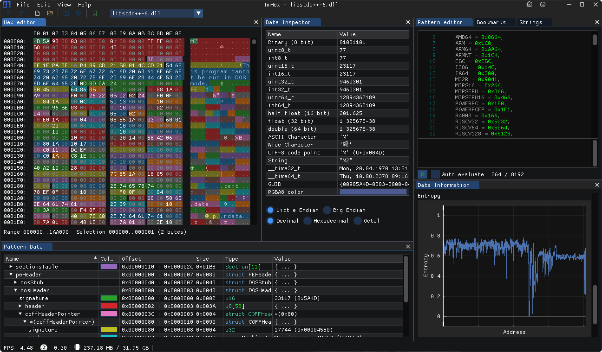
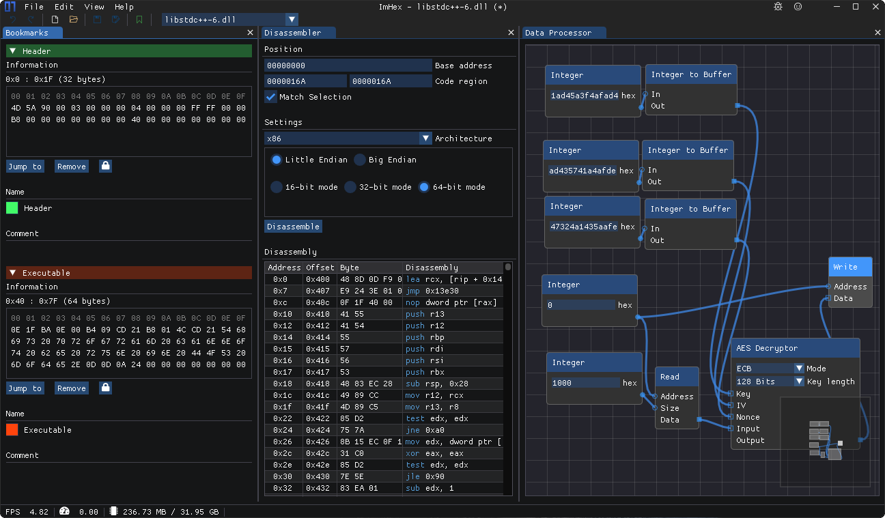

# ImHex

#### Links

**Main Repo:** [https://github.com/WerWolv/ImHex](https://github.com/WerWolv/ImHex)

**Database Repo**: [https://github.com/WerWolv/ImHex-Patterns](https://github.com/WerWolv/ImHex-Patterns)

**Documentation Repo**: [https://github.com/WerWolv/Documentation](https://github.com/WerWolv/Documentation) under `imhex`

### Pattern Language


The **Pattern Language** is ImHex's custom data processing language. For more information about the Language itself, check out its documentation page or the file format repository below&#x20;



[Pattern Language](https://app.gitbook.com/o/xfl3734L2rDBS2sD53Zi/s/WZzDdGjxmgMSIE3xly6o/)




### Screenshots

<figure><figcaption></figcaption></figure>

<figure><figcaption></figcaption></figure>
