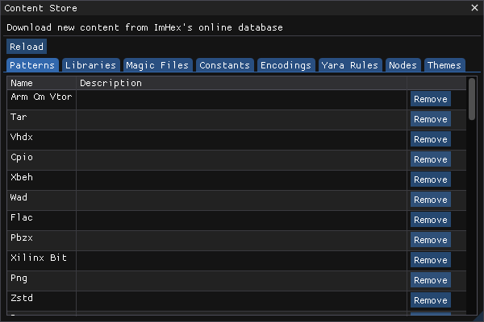

# Content Store

<figure><figcaption>
The Content Store
</figcaption></figure>

The Content Store is a simple store front that can be used to download extra features made by the community.&#x20;


If you'd like to add your own items to the store, please submit a PR to the [https://github.com/WerWolv/ImHex-Patterns](https://github.com/WerWolv/ImHex-Patterns) GitHub repository. Once your PR has been merged, the new files will automatically show up for everbody.


### Content

The tabs at the top of the Store represent all the different available categories.

* `Patterns`: Pattern Language Pattern files for various popular formats and data layouts
* `Includes`: Pattern Language Libraries such as the Standard Library.
* `Magic Files`: Files used to determine the type of the data you loaded. These files also enable automatic loading of patterns.
* `Constants`: Constant declaration files used in the Constants view.
* `Encodings`: Custom encodings to decode bytes and display them in the Hex Editor's advanced decoding column.
* `Yara Rules`: Custom Yara rules that can be matched against in the Yara View.
* `Nodes`: Custom Nodes for the Data Processor
* `Themes`: Custom ImHex themes generated through the `Theme Manager`.

### Downloading content

To download any file, simply click on the `Download` button next to it. Once it's installed, it's immediately available in ImHex. To remove the file again, click on the `Remove` button that showed up in its place.

&#x20;Files that have been modified upstream but have already been downloaded to your machine can be updated using the `Update` button next to them.

If the upstream repository has been modified since you opened the content store, the list can be updated using the `Reload` button.
