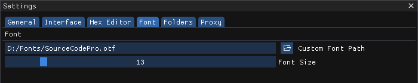

# Fonts

By default ImHex uses the `Proggy Clean` font, the default one used by ImGui, however it's also possible to load custom fonts.


Proggy Clean is a pixel perfect bitmap font which means scaling it only works well if it's done in integer increments. Any scaling factor inbetween will cause the font to look blurry. Because of that, setting the font size is disabled by default.


### Supported fonts

Any `TTF` or `OTF` font is generally supported. However, things might look off when using a font that doesn't have monospaced glyphs. So called "Nerd Fonts" such as the fonts found on this GitHub repository, usually work great: [https://github.com/powerline/fonts](https://github.com/powerline/fonts)

### Changing fonts

To change your font, first open the `Settings` interface through `Help -> Settings` and open the `Fonts` tab. After that, either enter the path to your font in the `Custom Font Path` text field or click on the folder icon next to it to use the file picker.

<figure><figcaption>
A cutom font being selected in the Settings interface
</figcaption></figure>


The Font file is not copied, only the path is stored in ImHex's settings. Don't remove the font file after it has been selected or ImHex will revert back to the default font.


Doing this also made the `Font Size` slider selectable now and can be used to adjust the font size independent of ImHex's scaling.

ImHex needs to be restarted now for the changes to come into effect.
