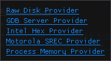

# Providers

Providers in ImHex are how any data is being accessed. They expose a common interface to read or write any data to ImHex and handle everything else that's necessary for it to work in the background. Every file you open, every process you attach to, creates a new instance of a provider which handles data accesses to this source.

### Usage

The most simple way to use Providers is by loading any file. Either through \
`File -> Open File...`, the `Open File` shortcut on the Welcome Screen or by dragging a file onto ImHex. This will open a FileProvider to access its data.

Besides the FileProvider, there's also more complex ones accessed through `File -> Open Other...` or `Other Providers` on the Welcome Screen.

<figure><figcaption><p>Other providers</p></figcaption></figure>

Clicking on any of these buttons creates a new instance of this provider and opens a configuration popup to specify additional parameters. Some providers simply open a file picker here, others display custom windows. Clicking `Open` opens the provider with these settings.

<figure><figcaption><p>Process Memory Provider configuration popup</p></figcaption></figure>

### Implementation

In C++, Providers are implemented as a polymorphic Provider base class which, amongst others, has the following functions:


```cpp
// Called when a new provider is created. Opens a connection
// to its data source
bool open();

// Called when the provider is closed. Handles cleanup
void close();


// Called whenever ImHex wants to read any data from this provider
void readRaw(u64 offset, void *buffer, size_t size);
// Called whenever Imhex wants to write any data to this provider
void writeRaw(u64 offset, const void *buffer, size_t size);

// Called when ImHex wants to know the size of this data
size_t getActualSize();
```


The standard File Provider for example uses standard C File IO functions to access a file. It calls `fopen()` in the `open()` function, `fclose()` in the `close()` function and `fread()`/`fwrite` in the `readRaw()`/`writeRaw()` function. This is the simplest example for a Provider and it's far from what a Provider can do. `readRaw` and `writeRaw` can make calls to other applications, a web service, the Kernel or any other data source one might want to analyze.&#x20;

This system allows ImHex to act as a universal data access frontend. If a new source is needed, simply implement a new Provider for it.
