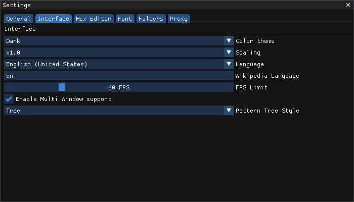

# Settings

The Settings page can be accessed through the Main Menu by choosing `Help -> Settings`. It contains multiple tabs with settings for various parts of ImHex.

<figure><figcaption>
The Settings Window
</figcaption></figure>
