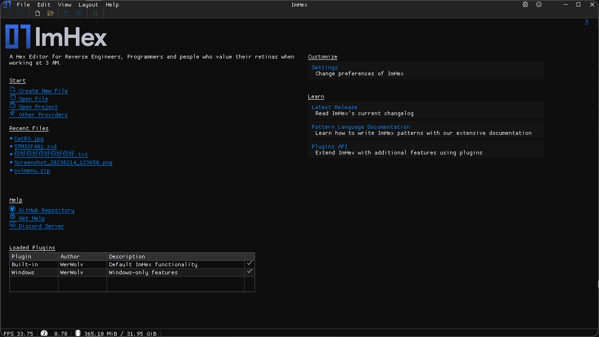

# Welcome Screen

<figure><figcaption>
The Welcome Screen
</figcaption></figure>

The Welcome Screen is what shows up at the start when ImHex is loaded. It contains a bunch of frequently used options and information.


Pressing the `X` button at the top right will close the Welcome Screen without loading any file. Useful when you want to interact with features of ImHex that don't require any data to be loaded.


### Start

The Start section contains buttons to quickly get into editing mode with either a new set of data or opening existing data.&#x20;

* `Create New File`: Creates a new, unsaved file that is stored in memory. Saving it will create a new file.
* `Open File`: Opens a file picker popup to choose a new file to open in the editor
* `Open Project`: Opens a file picker popup to open a previously saved Project file. This will restore all providers that were open and all their settings.
* `Other Providers`: Shows a list of available special providers. Clicking on any of the providers in the list will open a special load interface that depends on the provider being loaded.

### Recent Files

The Recent Files section provides links to last 5 Providers that were opened. Clicking on the links will restore them.

### Help

Links to the GitHub Repository, Discussions Page and the Discord Server

### Plugins

The Plugins section contains a table containing all the currently loaded Plugins.&#x20;

By default on all Platforms there's the `Built-In` plugin which contains all the base functionality of ImHex. Windows users also have a `Windows` plugin for Windows-only features.

If custom plugins are being loaded, they will also show up in this list.

### Customize

Links to customization options within ImHex such as the Settings.

### Learn

Learning resources about ImHex including a link to this documentation page, a link to the latest release and the Plugin API Documentation.
