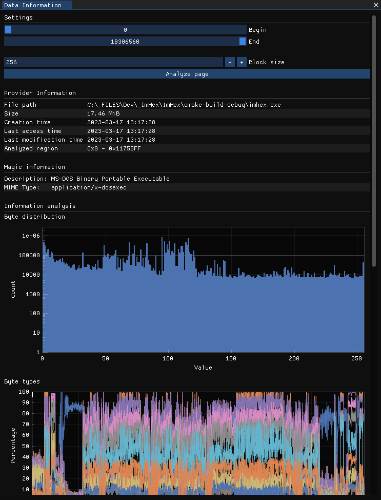
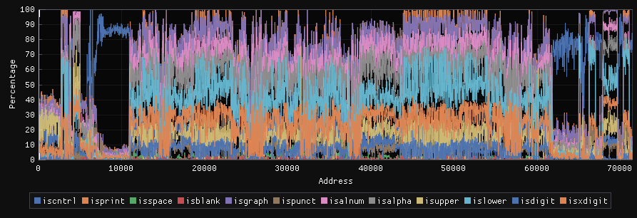

# Data Information

<figure><figcaption>
The Data Information View
</figcaption></figure>

The Data Information View gives visual insight into various aspects of the file's binary composition through analysis information, diagrams and tables.

### Starting the analysis

To start the analysis, first select the start and end address that will be analysed as well as the block size that's being used in the `Settings` section at the top.


The block size heavily depends on the kind of data you're interested in. Lowering it will show finer details but also increases the noise level. Increasing it will average out small details but also remove most of the noise.


### Provider Information

This section contains additional information that has been provided by the data provider. The information found here will differ depending on the type of provider that's being used.

For a simple file provider, the table will display the file path, size, creation, access and modification as well as the region that has been analyzed by this view.

### Magic Information

This section displays some helpful information about the file format itself and it's MIME type. It uses `libmagic` for this which is the same library that's being used by the popular `file` command on Linux.


If this section is missing, make sure you installed the relevant Magic database from the Content Store.


### Information analysis

#### Byte distribution

<figure><figcaption>
Byte Distribution graph
</figcaption></figure>

The Byte distribution graph is a Histogram which displays the number of occurrences of each byte using a logarithmic scale. In the graph above you can see that most bytes are equally likely to occurr but bytes close to `0x00` and around `100` (the ASCII range) are more abundant.&#x20;

#### Byte Types

<figure><figcaption>
Byte types graph
</figcaption></figure>

The byte types graph displays a stacked relative frequency graph which contains information about how often a certain type of byte occurres within a block of data. The X-Axis of this graph represents the block's address and the Y-Axis the percentage of bytes in this block that are of the relevant type.&#x20;

The byte type is determined using the [`<cctype>`](https://en.cppreference.com/w/c/string/byte) functions listed in the legend below. To hide certain types, simply click on their legend entry. There's also a drag bar on the graph that can be moved around to jump to the offset of that block in the Hex Editor View.image

<figure><figcaption>
Table representing which bytes are captured by which byte type
</figcaption></figure>

#### Entropy

<figure><figcaption>
Entropy graph
</figcaption></figure>

The entropy graph displays the [Shannon Entropy](https://en.wikipedia.org/wiki/Entropy\_\(information\_theory\)) of each block using the following formula:

$$
\displaystyle H(X)=-\sum_{i=1}^{n}p(x_i)*\log_{2}(p(x_i))
$$

A higher entropy value corresponds to "more random" data. So big regions of the same value have a low entropy, big regions of completely random values have a high entropy.

The graph also has a drag bar again that can be moved to jump to that block's address.

#### Composition information

<figure><figcaption>
Composition information
</figcaption></figure>

This table displays information about the entire composition of the data.&#x20;

* `Block Size` refers to the number of blocks that have been created and their individual size.
* `Overall entropy` displays the entropy value of the entire data.
* `Highest block entropy` and `Lowest block entropy` shows the value and address of the block with the highest or lowest entropy value.
* `Plain text percentage` shows the percentage of the file that consists of plain text ASCII characters.

#### Inferred properties

ImHex tries to figure out potential properties of data based on the parameters it calculated before. These are displayed in Red below the composition information.

<figure><figcaption>
Compressed or encrypted data with a high entropy was analyzed
</figcaption></figure>

<figure><figcaption>
Data with a very high number of ASCII characters was analyzed
</figcaption></figure>

#### Digram

<figure><figcaption>
Digram
</figcaption></figure>

The Digram visualizer takes random pairs of two bytes from the data and calculates their relative frequency. The value of the first byte is then used as the Y-Value, the value of the second byte as the X-Value starting from the top left. Pairs of bytes that are less abundant are then displayed in a faint Orange while pairs that appear more frequently are displayed in Blue or White.

#### Layered Distribution

<figure><figcaption>
Layered Distribution
</figcaption></figure>

The Layered Distribution or Layered Digram plot works the same way as the regular Digram visualizer but takes the position in the file into account as well. To do this, the file is split into a number of equally sized chunks and a digram is generated for each of these chunks. The chunks are then stacked on top of each other to generate a 3D-Cube. When looking onto the cube from the top, you see the same image as in the regular Digram. When looking on it from the side, you see the Layered Distribution.&#x20;

The X Axis shows the byte value and the Y Axis the position in the file. Brigther values are more abundant in the the data.&#x20;
