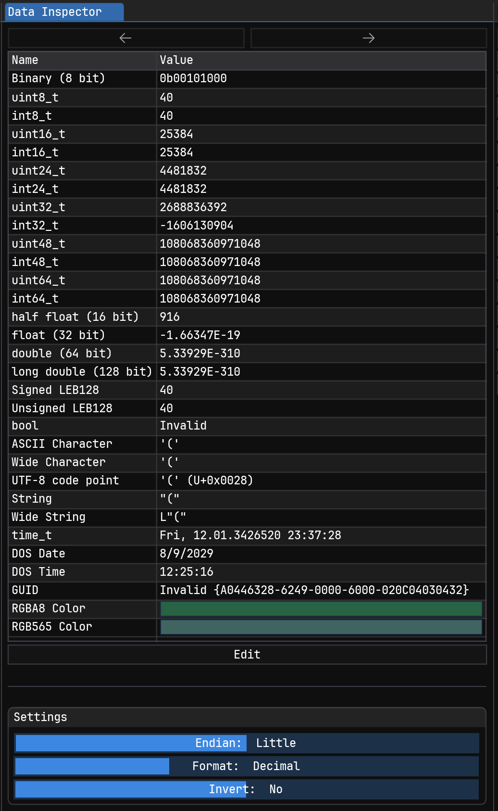

# Data Inspector

<div data-full-width="false"><figure><figcaption><p>The Data Inspector View</p></figcaption></figure></div>

The Data Inspector aids identifying of encoded values in binary data without needing to write a full Pattern definition for it. It simply takes one or more bytes (depending on the type it decodes the bytes as) from the current cursor position in the data and decodes it as it.


Not all rows necessarily display a useful value. The Inspector tries to identify invalid decodings and display `Invalid` in that row but that's not always possible. Just because the data inspector says these bytes mean a specific thing, doesn't mean that that's the actual meaning of those bytes.


Right click a row to open the context menu

<figure><figcaption><p>Context Menu</p></figcaption></figure>

* `Jump to address`: Interpret the decoded value as an address and jump to it
* `Copy Value` : Copies the decoded value
* `Edit Value` : Enters editing mode so a new value can be input. This will write the raw bytes back to the opened data. Editing mode can also be entered by double clicking a row.&#x20;

### Next/Previous value

<figure><figcaption><p>Next/Previous buttons</p></figcaption></figure>

It's possible to click on an entry in the data inspector to select it. After that, the "Previous" and "Next" button above the inspector table become active and can be used to move to the previous or next instance of that type. The current selection will be moved according to the size of the selected row.

This is helpful when analyzing formats that contain lists of the same data type and you'd like to see their decoded value one at the time.

### Hiding Rows

It's possible to hide individual rows in the data inspector that aren't important for the current file. To do this, simply click on the `Edit` button and click on the Eye icon on the rows that should be hidden. Clicking on the `Edit` button again then, hides all the selected rows.

<figure><figcaption><p>Hiding / Unhiding rows</p></figcaption></figure>

### Modifying values

Some rows can also be modified for the data inspector to write the encoded byte value of your input back to where it read the previous value. This is not possible for all rows.

To do this, simply double click the row you want to edit and a input text field will appear where the new value can be entered.

### Settings

At the bottom of the Inspector there are multiple sliders to customize how values are being displayed in the Value column.

<figure><figcaption><p>Settings</p></figcaption></figure>

* `Endian`: This setting specifies the endianess of read data. Switching it from `Little` to `Big` will invert the order of bytes before trying to decode it
* `Format`: This setting changes the numeric base the values are displayed in such as Decimal, Hexadecimal or Octal. This only makes sense for numeric values so it only applies to these.
* `Invert`: This setting bitwise inverts the value of every read byte before decoding it. As such the byte `0xFA (0b1111'1010)` will become `0x05 (0b0000'0101)`.

### Adding new Rows

Adding new rows to the inspector can either be done through a custom Plugin, when needing custom display widgets or extra speed, or it can be done through the Pattern Language by adding a new `.hexpat` file to the `%IMHEX_PATH%/scripts/inspectors` folder.


```rust
import std.io;

// Type definition for the custom type we want to decode
struct MyCustomInspector {
    u32 value;
} [[format_read("custom_inspector_formatter")]];

// Formatter function which formats the displayed value
fn custom_inspector_formatter(MyCustomInspector customInspector) {
    return std::format("Hello World: {:02X}", customInspector.value);
};

// Placements. Each individual placement becomes a new line in the inspector
// All values need to be placed at the current cursor position ($) to respect
// the cursor position set in the editor
// The [[name]] attribute changes the value in the Name column, otherwise
// 'customInspector' would be used.
MyCustomInspector customInspector @ $ [[name("Custom Inspector Name")]];
```


The next time the cursor position is changed now, the new row will show up and decode the selected bytes.

<figure><figcaption><p>Custom Data Inspector Row</p></figcaption></figure>
