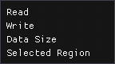

# Data Processor

<figure><figcaption>
The Data Processor
</figcaption></figure>

The Data Processor is a node-based visual scripting engine that has the ability to pre-process bytes before they are being displayed or read by the rest of ImHex. The program in the image above for example XORs all bytes in the loaded data with the ASCII character `A` before displaying them in the Editor.

### Terminology

#### Nodes

<figure><figcaption>
A Node
</figcaption></figure>

Nodes are the rectangular boxes that are placed through the context menu. Each node has a certain number of Inputs on the left side and Output on the right side. When the program is executed, each node will read in data from the left, processes it in some way and then outputs it again on the right. Nodes that have no inputs are called "Start Nodes", Nodes that have no outputs are called "End Nodes".

Each Node has a name which is being displayed at the top in the header.

Below that, there's an area where each node can display its own widgets either for confguring various settings or to simply visualize the data it received.

#### Attributes

Attributes are the Connections on the side of each Node. Attributes on the left are called "Input Attributes" since data is being fed into them, Attributes on the right are called "Output Attributes" since they output processed data.

There are different types of Attributes, denoted using different symbols.&#x20;

*  Circular Attributes are Integer Attributes
*  Triangular Attributes are Float Attributes
*  Rectangular Attributes are Buffer Attributes

If a Attribute is on the left side of a Node and not filled, it's a Input. If it's on the right side of a Node and filled out, it's a Output.

<figure><figcaption>
Connecting two Nodes to each other
</figcaption></figure>

Integer and Float input Attributes can also be initialized directly by writing their value into the field next to its name. As soon as a different Node is being connected to this Attribute, it will take precedence over the value entered in the Node.&#x20;

#### Links

<figure><figcaption>
Link between two Nodes
</figcaption></figure>

Links are the connection that is made between two Attributes. It represents the flow of information from one Ouput Attribute to another Input Attribute.&#x20;

Links can only ever be made between two Attributes of the same type. So it's not possible to connect a Buffer Attribute to a Integer Attribute or an Integer Attribute to a Float Attribute.

To form a new Link between two Attributes, click on the Attribute of one Node and drag the created Link over to the Attribute of a different node. This is only possible if one of the Attributes is a Output and the other one is a Input.

To delete a Link again, simply click on it or use `Right click -> Remove Link`.

### Navigation

Navigation in the Node workspace is very simple. Pressing and dragging using the `Left Mouse Button` creates a selection that can be used to select Nodes and Links. The `Middle Mouse Button` is used to pan the view around in the workspace. Clicking the `Right Mouse Button` opens a context menu that contains options depending on what has been right clicked. When right clicking the workspace, a menu pops up with a list of all Nodes that can be placed.

### Execution

<figure><figcaption>
Execution widgets
</figcaption></figure>

After a data processor script has been made, it can be executed by clicking on the `Play` button, similar to the Pattern Editor.&#x20;

Enabling the `Continuous evaluation` checkbox will cause the script to be executed every frame. This is helpful for scripts that only modify a small number of bytes but either the data or the parameters used in the script are continuously changing.

### Important Nodes

#### Constants

<figure><figcaption>
Constant Nodes list
</figcaption></figure>

Constant Nodes are the simplest kinds of Start Nodes. They all have a input text box to specify their value and output that value directly on their output Attribute. These Nodes can be treated as Variables that can be set once before the program starts and then be reused again later on.&#x20;

#### Data Access

<figure><figcaption>
Data access Nodes list
</figcaption></figure>

Data Access nodes are the one type of node that can directly interact with the loaded data.&#x20;

The `Read` Node reads a certain number of bytes from an address of the currently loaded data into a buffer and outputs it on its Output Attribute.

The `Write` Node can write a buffer back into the loaded data at a certain address. Doing so will overlay the written data over the existing data. **It does not modify the underlying data directly, it's purely visual.** These two nodes in combination are the heart of the data processor and are most likely required in every data processor script you make.

`Data Size` simply returns the size of the loaded data and `Selected Region` returns the address and size of the current selection. This is useful in Continuous Mode so selections can be used as a sort of magnifying glass where only the bytes inside of them are being processed.

### Custom Nodes

An important feature of the data processor is the ability to create your own custom nodes using the existing ones and sharing them with others.

To do this, select `Custom -> New Node` in the right click menu. A new, empty Node will appear. To modify it, hold down shift and give it a name by entering it in the Text box. This is the name that will appear in the Node's header as well as in the Context menu once the Node has been saved.

<figure><figcaption>
Custom mode regulary
</figcaption></figure>

 

<figure><figcaption>
Custom node when holding shift
</figcaption></figure>

Clicking on `Edit` will open a new empty workspace. This is the content of this Custom Node. It can be closed again through the `X` button at the top right.

A Node needs to be able to receive data from the outside world and return it back out again after it has been processed. This is done through Input and Output Nodes found in the `Custom` section under `Custom Node Input` and `Custom Node Output`. Placing them will let you chose the Attribute Type as well as the name that will be displayed on the Node later on.

Let's use these Input and Output Nodes to create a custom Node that takes in an Integer called `Value`, adds the number `5` to it and outputs it again on an Attribute called `Result`.

<figure><figcaption>
Simple Add 5 Custom Node
</figcaption></figure>

Exiting the Custom Node again now through the `X` button reveales that the Custom Node has changed. It now has a `Value` input and a `Result` output. Feeding a number into the node now correctly adds the number `5` to it and returns the result back to us.

<figure><figcaption>
Add 5 Node in action
</figcaption></figure>

