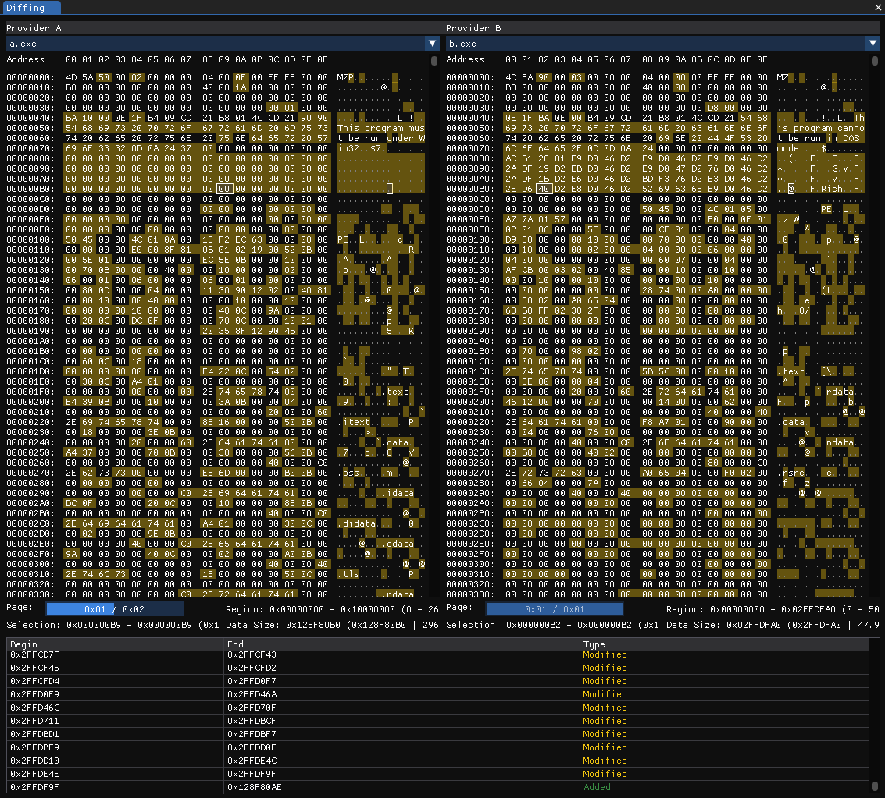

# Diffing

<figure><figcaption>
The Diffing View
</figcaption></figure>

The Diffing View implements a simple byte-to-byte comparison algorithm to allow for easy detection of differences between two sets of binary data.

### Diffing

First of all, to diff the content of two providers, two providers must be opened. To compare these two providers with each other now, select the providers in the combo box at the top under `Provider A` and `Provider B`. This will open both files next to each other in two new hex editor views.

All bytes that differ from each other between the two providers will now be highlighted.

* `Yellow` marked bytes differ from each other in their value.
* `Green` marked bytes exist in Provider A but not in Provider B.
* `Red` marked bytes exist in Provider B but not in Provider A.

### Differences list

The table below the two diffing hex views contains all differences between the two providers listed individually. Clicking on a row will jump to that location and select the region in both hex views.
