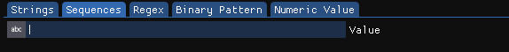
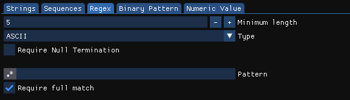

# Find

<figure><figcaption>
The Find View
</figcaption></figure>

The Find View allows you to search the entire data or just parts of it for sequences of bytes that match certain constraints.

#### Selecting the data to search

Using the range combo box at the very top, you can can change the region of bytes that is being searched. By default, `Entire Data` is selected which will cause all bytes in the data to be traversed. If only a small section of the data should be processed, select `Selection` and then select the region of bytes you want to be searched in the Hex Editor View.

#### Search strategies

Depending on the kind of data you're looking for, a different strategy needs to be chosen. This can be done by selecting the relevant strategy using the Tab bar. Doing so will also change the available options to the ones relevant for this operation.

**Strings**

<figure><figcaption>
Strings search options
</figcaption></figure>

The Strings search strategy can extract ASCII, UTF-16LE and UTF-16BE strings or a combination of ASCII and UTF-16 strings. The string types that will be looked for can be chosen through the `Type` combo box.

Using the `Minimum length` input field, the minimum number of characters in the string can be specified. Lowering this number will allow shorter strings to show up in the results list which can drastically increase the likelyhood of false-positives.

In the advanced match settings, additional requirements for the strings can be set. Enabling these options will cause all strings that don't match their criterias to be discarded.

* `Require Null Termination` requires all strings to end with a `0x00` NULL character.
* The `Characters` option limit the categories of characters that are allowed to be present in the string. Disabling all options except the `Upper case letters` option for example will cause only strings to be matched that contain only upper case characters.

**Sequences**

<figure><figcaption>
Sequences search options
</figcaption></figure>

The Sequences search strategy simply searches all occurrences of a specific string. For example searching for the value `Test` will list all occurrences of this sequence of four characters in the data.

**Regex**

<figure><figcaption>
Regex search options
</figcaption></figure>

The Regex search strategy works the same as the Strings strategy. It first extracts all strings of a given size and type from the data and then filters them using the Regex Pattern that was specified in the `Regex` field.

If the `Require full match` option is enabled, a string is only included if the entirety of it matches the specified pattern. If it's disabled, only a part of the string needs to match for it to be included.

**Binary Pattern**

<figure><figcaption>
Binary Pattern search options
</figcaption></figure>

The Binary Pattern search strategy lists all byte occurrences in the data that match a given Binary Pattern. More information about the format can be found on the relevant documentation page.

**Numeric Value**

<figure><figcaption>
Numeric Value search options
</figcaption></figure>

The Numeric Value search strategy searches the data for occurrences of numeric values whose values are within a certain range. It will interpret the bytes at every address in the data as the specified Type and compare it to the range of allowed values.

The `Minimum Value` and `Maximum Value` fields are used to specify the range of values that are allowed.

The `Type` combo box is used to specify the type of number that you're looking for. Such as Signed or Unsigned integers of various sizes or floating point numbers.

The `Endian` setting specifies the endianess of the value you're looking for. Big endian values will have their byte order reversed before being compared to the allowed range.

#### Executing the search

After configuring the search parameters, clicking on the `Search` button will start the search operation. Depending on the type of search and the size of the data to be searched, this can take a while. Once it's done, all the found values will be listed in the table at the bottom. The bytes will also be highlighted in the Hex Editor View.

To reset the search and delete all highlightings from the data, click the `Reset` button.

#### Results Table

The results table contains all the occurrences that have been found in the data. The `Offset` and `Size` column show the region where this occurrence has been found and the `Value` column shows the decoded value that was found. Clicking on one of the rows will cause the Hex Editor to jump to this location.
