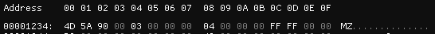
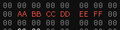

# Hex Editor

The Hex Editor View is the most important View in ImHex. It displays the currently loaded data as a range of hexadecimal values and ASCII and lets you modify it.

<figure><figcaption><p>The Hex Editor View</p></figcaption></figure>

### Selections

To interact with the bytes in any way, they first need to be selected. To do that, click on one and optionally drag your mouse cursor to select bigger ranges of bytes. This can be done either on the main hexadecimal column or on the ASCII column.

Once a selection has been made, the current cursor can also be moved around using the arrow keys. Holding down SHIFT lets you select a range of bytes.

### Base Address

Through the use of the Edit -> Set base address option, ImHex can virtually load a file not at address 0x000000 but at any arbitrary address. This is mainly useful for analysing memory dumps that have been dumped from a specific address. Doing this will affect displayed addresses throughout all of ImHex.

<figure><figcaption><p>Hex editor view with its base address changed to 0x1234</p></figcaption></figure>

### Selection Views

Sometimes files consist of multiple different parts in which case it might be easier to analyse each of these parts on their own. For these cases, Edit -> Open selection view takes all currently selected bytes and breaks them out into a new tab. This new tab contains a transparent view of only the selected bytes now and making modifications to them in one tab will automatically apply the same modifications in the other tab.

## Editing

To edit the value of a byte, simply double click it to enter editing mode. The value of the byte becomes highlighted and a new value can be entered. Once enough characters have been entered, the cursor automatically advances to the next cell so the next value can be entered. Notice how modified bytes are highlighted in red.

<figure><figcaption><p>Modified bytes</p></figcaption></figure>

#### Size changing operations

Size changing operations include byte insertions, byte removal and resizing.


These operations are rarely needed when analysing or patching data since they can change the layout of the data and will most likely make it unreadable by other programs.


All of these operations can be found in the `Edit` main menu or in the Hex Editor's right-click menu.

<figure><figcaption><p>Operations in the edit menu</p></figcaption></figure>

A popup window will open asking for the start address of the operation and the number of bytes that will be affected. Clicking on `Set` executes it. In the case of the following image, `0x10` zero bytes will be inserted at address `0x1A0`. The Remove and Resize operation work similarly.

<figure><figcaption></figcaption></figure>


Since ImHex cannot store the entire content of files in memory due to their size, all size changing operations directly modify the underlying data and cannot be undone.


### Copy / Paste

These operations let you copy bytes in various ways and paste them back into the data later on. All copy and paste operations only operate on the currently selected bytes. Using `Edit -> Copy` on the following selection will copy the string `1B D2 E6` into the clipboard. Selecting only two other bytes now and using `Edit -> Paste` will paste `1B D2` at that selection and discard `E6`.

<figure><figcaption><p>Three selected bytes</p></figcaption></figure>

#### Copy as...

The Copy as operation copies a formatted representation of the selected bytes into the clipboard. Possible representations are arrays in the syntax of various programming languages, as well as ASCII art, HTML and more.

Some Examples:


```cpp
constexpr std::array<uint8_t, 3> data = {
    0x1B, 0xD2, 0xE6
};
```



```
Hex View  00 01 02 03 04 05 06 07  08 09 0A 0B 0C 0D 0E 0F
 
000000A0        1B D2 E6                                     ...
```


#### Paste All

Paste All always pastes all copied bytes, no matter of the number of currently selected bytes or if the file is big enough to hold all bytes. If there's not enough space left for all bytes after the current cursor position, the data will automatically be resized to fit it.

### Jump to

The jump to operation interprets the currently selected bytes (up to a max of 8 bytes) as a little endian unsigned number and jumps to that address. For example, selecting the bytes `45 00 00` and clicking `Jump to` will interpreted these bytes as the number `0x000045` and then jump to this address in the editor.

*
