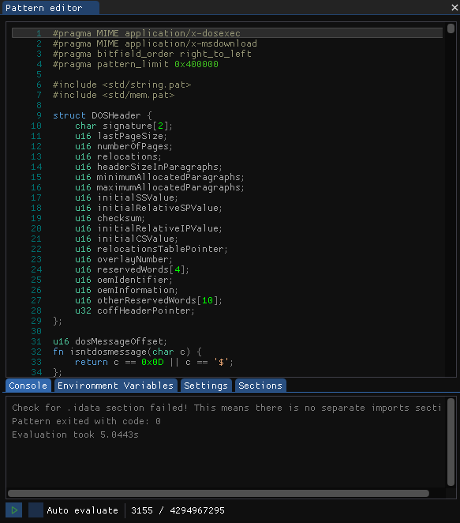

# Pattern Editor

<figure><figcaption>
The Pattern Editor View
</figcaption></figure>

The Pattern Editor view is the main way to interact with the Pattern Language in ImHex. It consists of a text editor at the top followed by a information and configuration section.

### The Pattern Language

The Pattern Language is a custom C++ and Rust inspired scripting language that can be used to analyse binary data. In ImHex it's tightly integrated with the Hex Editor View to provide highlighting of byte regions and the Pattern Data View to display all generated patterns.

For more information on the Pattern Language, consult the [Pattern Language Documentation](https://app.gitbook.com/s/WZzDdGjxmgMSIE3xly6o/).

### Writing Pattern Language code

The main part of the Pattern Editor View is a text editor. It provides simple editing capabilities as well as syntax highlighting for the Pattern Language. All source code entered here will be parsed and executed when requested.

### Running a Pattern

To execute a Pattern after writing it, simply press the `Play` button at the bottom of the view. A spinner will show up and the `Play` button will turn into a `Abort` button which aborts the current execution when clicked.

<figure><figcaption>
Run button
</figcaption></figure>

When the `Auto evaluate` checkbox is activated, the source code is automatically executed every time it is modified.


Using the `Auto evaluate` option is only recommended for small patterns as bigger ones may take several seconds to execute which will lead to performance issues while typing.


The two numbers next to the checkbox represent the number of patterns that have been created and the maximum number of allowed patterns.

### Information and Configuration Section

Below the text editor are multiple tabs that provide further information about the executed pattern and allow configuring certain parameters.

#### Console

<figure><figcaption>
Console tab
</figcaption></figure>

The Console displays textual information generated by the Pattern Language runtime. Either information printed there by the User or errors generated by the runtime.

The following colors are used:

* `Green`: Debug information generated by the evaluator
* `White`: Regular print output
* `Yellow`: Warnings generated by the user or the runtime
* `Red`: Critical errors that prevent further execution of the code

Individual lines can also be copied by clicking on them.

#### Environment Variables

<figure><figcaption>
Environment Variables tab
</figcaption></figure>

The Environment Variables tab allows you to specify environment variables that can be read by Pattern Language source code through the use of the `std::env(str name)` function.

Each line represents a single environment variable. Clicking on the `+` button inserts a new variable, clicking on the `-` button removes it.

The Combo box on the left side specifies the type of variable.

* `I`: Integer
* `F`: Floating Point
* `S`: String
* `B`: Boolean

The field next to it specifies the name of the variable. This is the name that will be used in the source code to query value of this variable again.

The field to the right of the name field represents the value of this variable. Depending on the specified type, this will be an integer, float, string or a checkbox.

#### Settings

<figure><figcaption>
Settings tab
</figcaption></figure>

The Settings tab contains all variables that have been declared using the `in` or `out` keyword.\
A `in` Variable will generate a new line with an input widget that can be used to pass config information to the current pattern. When the pattern reads from the `in` Variable, it will read the value specified in this tab.

`out` Variables work the same way just in the other direction. The Pattern Language code can assign a value to this variable for it to be displayed in the settings tab.

#### Sections

<figure><figcaption>
Sections tab
</figcaption></figure>

The Sections tab contains all custom sections that have been created using the `std::mem::create_section(str name)` function.

The Pattern Language code can write data into this custom section and place patterns into it. This data can then be accessed by pressing on the `View` button in the right most column. A new window will open with a Hex Editor view containing the data of the section as well as a table containing all the patterns that have been placed in this section. They work the same way as their individual view counterparts.

<figure><figcaption>
Custom section popup window
</figcaption></figure>
