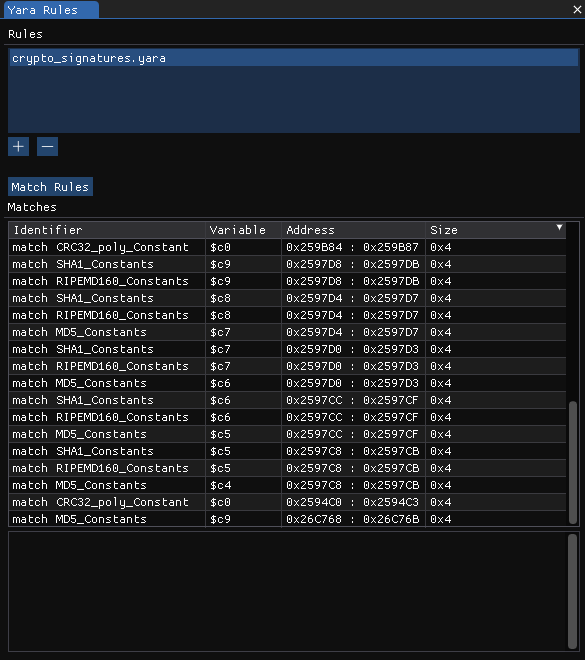

# Yara

<figure><figcaption>
The Yara View
</figcaption></figure>

The Yara View provides access to the Yara Rule support that's built into ImHex. It lets you choose one or more rule files and matches the entire data against them.&#x20;

For more information about how to use and write Yara rules, check out their [Documentation](https://virustotal.github.io/yara/).

### File Chooser

Before any matching can be done, first select one or more Yara Rule files. This is done by pressing the `+` button which opens the Choose file dialog. Either select a file from the provided list there or click on `Browse...` to open a regular file picker. To remove a file from the list again, click the `-` button.&#x20;

### Matching

To now match against the selected set of Rules, click the `Match Rules` button. This will execute all the Rules in order and at the end displays the results in the `Matches` table below. Clicking on a row jumps to this Match in the Hex Editor View.

If any Rule uses Yara's `console` module, its output will be displayed in the console below the matchs table.
