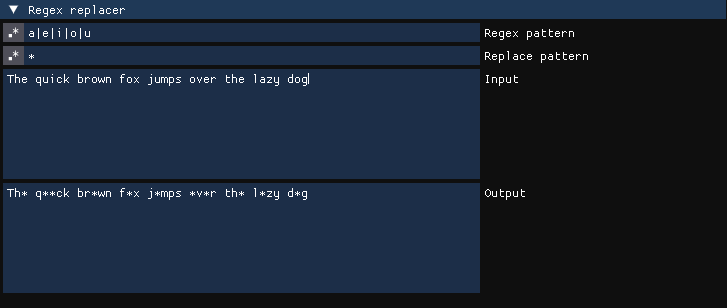
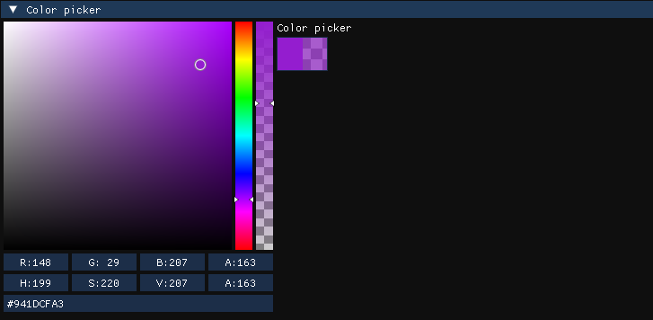
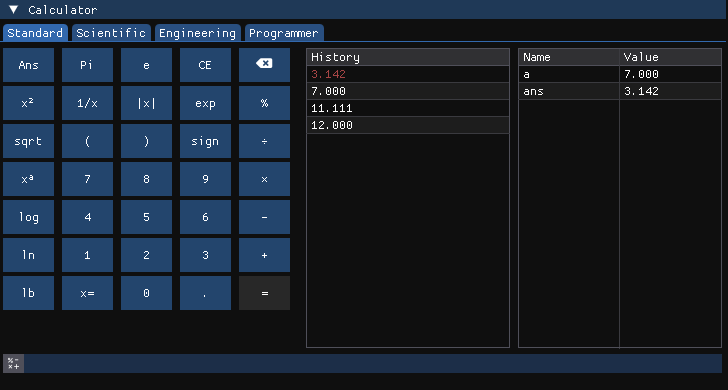
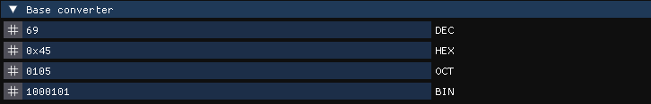
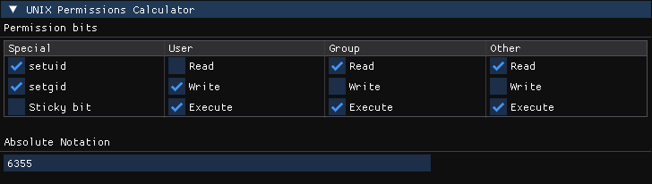
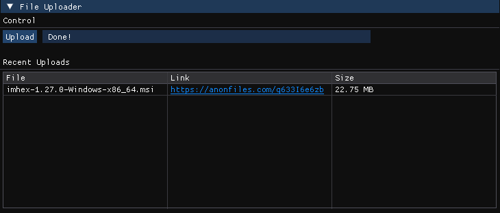

# Tools

The Tools View simply contains various different tools and niche helpers that didn't fit anywhere else in the Editor.&#x20;


All tools can be detacted and used as their own windows by simply closing them first and then dragging its header off of the tools window. The tool will automatically return to the tools window when it's being closed.




<figure><figcaption>
LLVM Demangler
</figcaption></figure>

This view takes a mangled type name from one of the following encoding standards and turns it back into the actual type name used in the respective programming language.

* Itanium (Mangling used by GCC and Clang in C++)
* MSVC
* Rust
* D-Lang

To decmangle a string, simply enter it in the text field at the top and the demangled version of it will be displayed in the text field below.



<figure><figcaption>
ASCII Table with Octal option turned on
</figcaption></figure>

The ASCII Table is a simple list of all standard ASCII characters and their corresponding Decimal, Hexadecimal and optionally Octal value. The octal columns can be turned on and off using the checkmark setting at the bottom.



<figure><figcaption>
Regex replacing all vowels in the Input text with asterisks
</figcaption></figure>

The regex replacer tool takes a input regex pattern and applies a regex replace operation on it.

The regex pattern field can contain any standard compliant regex pattern. For more information in this, consult the [Regex cheatsheet](https://developer.mozilla.org/en-US/docs/Web/JavaScript/Guide/Regular\_Expressions/Cheatsheet).

The following replace pattern syntax is permitted:

| Characters | Replacement                                                                                                                                                                                                                                                                                          |
| ---------- | ---------------------------------------------------------------------------------------------------------------------------------------------------------------------------------------------------------------------------------------------------------------------------------------------------- |
| $**n**     | 
<strong>n</strong>-th backreference (i.e., a copy of the <em><strong>n</strong></em>-th matched group specified with parentheses in the regex pattern). <em><strong>n</strong></em> must be an integer value designating a valid backreference, greater than 0, and of two digits at most.
 |
| $&         | A copy of the entire match                                                                                                                                                                                                                                                                           |
| $\`        | The _**prefix**_** ** (i.e., the part of the target sequence that precedes the match).                                                                                                                                                                                                               |
| $´         | The _**suffix**_** ** (i.e., the part of the target sequence that follows the match).                                                                                                                                                                                                                |
| \$$        | A single $ character.                                                                                                                                                                                                                                                                                |



<figure><figcaption>
Color picker tool
</figcaption></figure>

This tool contains a simple color picker to quickly turn hexadecimal values into colors or vice versa or convert between different color format standards such as RGB or HSV.

Right clicking the color picker allows switching from a color plane to a color wheel.

<figure><figcaption>
Color plane to color wheel popup
</figcaption></figure>





<figure><figcaption>
Calculator tool
</figcaption></figure>

The Calculator is a complete, stack-based postfix expression calculator. It works the same as many scientific calculators used in higher education.

The keypad on the right can be used to as shortcuts to enter various functions into the input field, however the input field at the bottom can also be modified directly.&#x20;

Pressing enter or clicking on the `=` button will evaluate the expression and add the new value to the history. The most recent result is highlighted in red and also stored in the `ans` variable to use it in further calculations.&#x20;

#### Assigning Variables

To assign values to custom variables, the following syntax can be used `x=100*3`. This will create a new variable called `x` and assign the result of `100 * 3` to it&#x20;

#### Display Modes

The following display modes are available:

* `Standard`: Displays the floating point results directly with 3 decimal points precision.
* `Scientific`: Displays the entire floating point result up to 5 decimal points precision and switches to exponent notation for bigger numbers.
* `Engineering`: Same as Scientific but displays numbers using their metric postfixes
  * `a`: Atto ->$$10^{-18}$$
  * `f`: Femto ->$$10^{-15}$$
  * `p`: Pico ->$$10^{-12}$$
  * `n`: Nano ->$$10^{-9}$$
  * `u`: Micro ->$$10^{-6}$$
  * `m`: Mili ->$$10^{-3}$$
  * `k`: Kilo -> $$10^3$$
  * `M`: Mega -> $$10^6$$
  * `G`: Giga -> $$10^9$$
  * `T`: Tera -> $$10^{12}$$
  * `P`: Peta -> $$10^{15}$$
  * `E`: Exa -> $$10^{18}$$
* `Programmer`: Displays all values as hexadecimal and decimal integers rounded down. Also replaces some of the buttons with bitwise operations.



<figure><figcaption>
Base converter converting the number 69 to different bases
</figcaption></figure>

The base converter simply takes a number in one base and converts it into all other available bases. These are currently Decimal (DEC), Hexadecimal (HEX), Octal (OCT) and Binary (BIN)



<figure><figcaption>
Unix permissions calculator
</figcaption></figure>

This tool generates the absolute octal notation for UNIX permissions based on what permissions bits have been set in the table above. The absolute notation is value used in commands such as `chmod`.



<figure><figcaption>
File uploader with a link to single file
</figcaption></figure>

The file uploader simply lets you choose any file on your system by clicking on the `Upload` button and uploads it to [https://anonfiles.com](https://anonfiles.com) so it can be shared with other people.

Clicking on the link will copy it to the clipboard, CTRL + Click will open it in your browser.


All uploaded files are publicly accessible using this link and will only stay on the site for a few days. The service is meant for quickly sharing files with others, not for long term storage.




